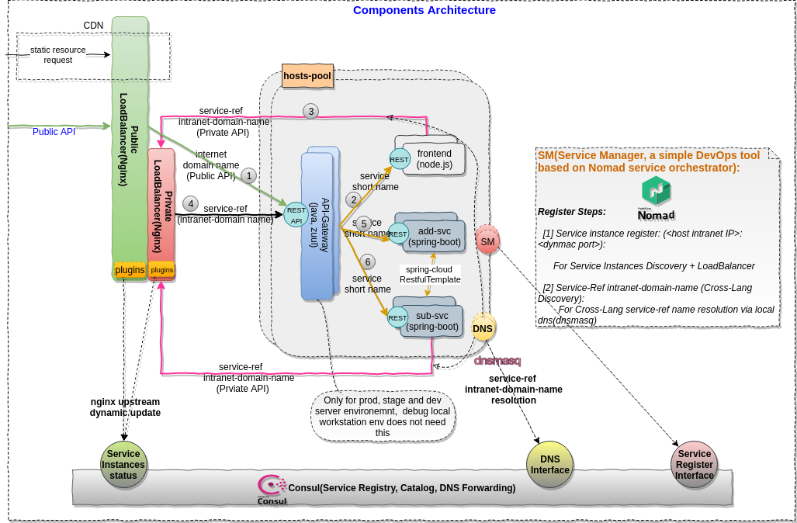
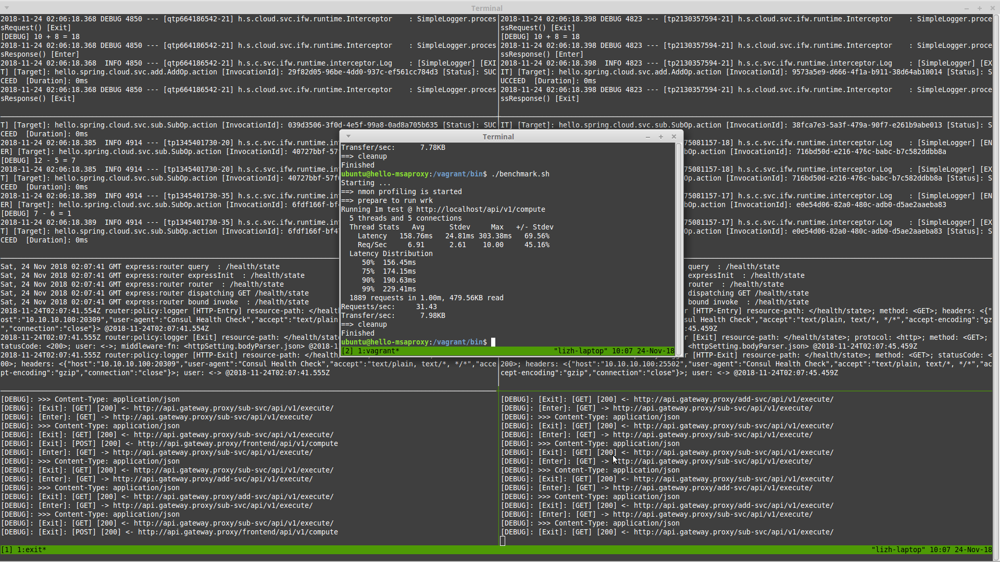

## Introduction

The purpose of this repository aims to provide a hands-on practices for my series articles [build a modern scalable system](https://leezhenghui.github.io/microservices/2018/11/01/build-a-scalable-system-practice-on-gateway-mode-for-mixed-lang.html). With this PoC(proof-of-concept) sample, we can learn how to **build** and **run** a `microservices architecture`(MSA) application(multiple programming languages) with the capabilities of service registry, naming resolution, client service disovery, client load balance, traffic shapping, failure tolerance, etc. 

## PoC Scenario 

The sample contains Java and Node.js modules. In reality, the RPC framework usually are programming language specific, so the challenge for us is how to enable a MSA application with mixed-languages. This sample will show you the approach of proxy pattern.

### Overview




### Load Balancer upstream dynamic update

- Nginx/HAProxy with Consul Template

- Nginx with Custom Module
  > - [Dynamic Nginx Upstreams for Consul via lua-nginx-module by Zachary Schneider](https://medium.com/@sigil66/dynamic-nginx-upstreams-from-consul-via-lua-nginx-module-2bebc935989b)
  > - [Nginx upsync module](https://github.com/weibocom/nginx-upsync-module)
  > - [Nginx Pro DNS resolution](https://www.nginx.com/blog/service-discovery-nginx-plus-srv-records-consul-dns/)
  > - [ngx\_http\_set\_backend](https://github.com/robinmonjo/ngx_http_l) which inspired binding Nginx modules in C to Consul in Golang

- HAProxy 1.8

  > HAProxy 1.8 brings resolution for ports through SRV records and support for EDNS, making it pair perfectly with Consul.


### Run the Sample 

For each service, we will schedule two instances with dynamic ports, and make the invocation with auto-service discovery and load balancing.

#### Steps

- Prerequisites 
  - Java
  - Node.js
  - Gradle

- Git clone the project

	On host:
  ```shell
  git clone git@github.com:leezhenghui/hello-msaproxy.git
  ```

- Gradle build/deploy distribution
  
  On host:
  ```shell
  cd hello-msaproxy/modules/frontend
  npm install
  cd ../../
  gradle deploy 
  ```

- Launch VM 
  
	On host:
	```shell
	cd ops
	vagrant up
  ```

- Provision the VM 
  
	On host:
	```shell
	vagrant provision 
  ```

- Start all nomad jobs 

  For each services, two intances will be created for a load balance, service discovery testing
  
	On host:

	```shell
  vagrant ssh
  ```

	In VM
	```shell
	cd /vagrant/bin
	./start_all_jobs.sh
	```

- Run the sample 

  In VM:
	```shell
	./click.sh
  ```

- Run benchmark 

  In VM:
	```shell
	./benchmark.sh
  ```

#### Result of Service Discovery and Load Balance


